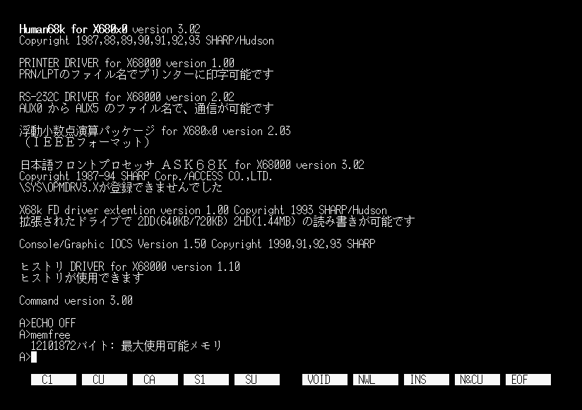
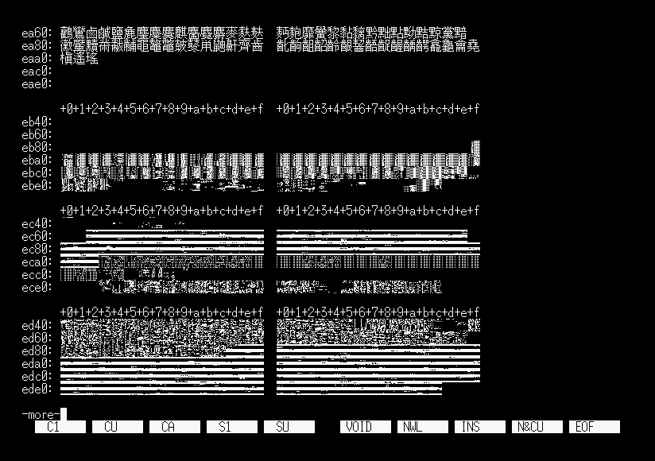
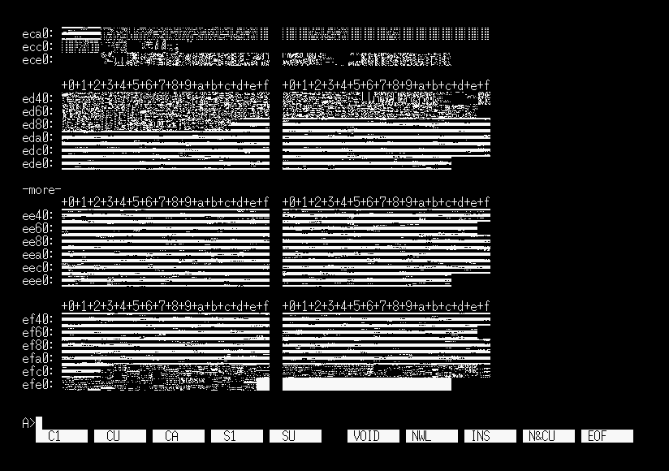
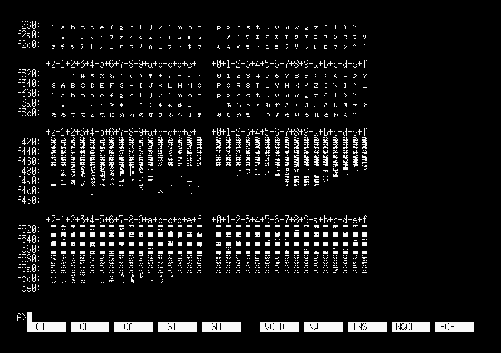

# USKCG

USKCGの右辺に何も書かず
```
USKCG =
```
とすると、Human68kは外字領域71872バイトの確保を行いません。  
ただしデバイスドライバ組み込み後にOS領域を8KiB単位に切り上げるので、起動後に増加する空きメモリは上記の数値より前後します。  
本体メモリ2Mだとギリギリ足りなくて製作中のゲームが起動できない、なんて場合に役に立つかも？

なお、USKCG行自体がない場合は既定値の`USKCG=USKCG.SYS`として扱われるので不可です。

 

外字領域を確保しない場合、フォントアドレスはIPL ROMにより設定された初期値のままになります。  
しかしその値が不適切もしくは領域未確保のケースが考慮されていないため、外字を表示するとゴミが表示されます。  
試してませんが多分、`IOCS _DEFCHR`で外字を定義するとメモリを破壊します。

 
 

$8540からは未定義領域のはずですが文字が表示されてるのは未調査です。

----
goto [index](../../../README.md) / [Human68k](../../README.md) / [CONFIG.SYS](../README.md)
